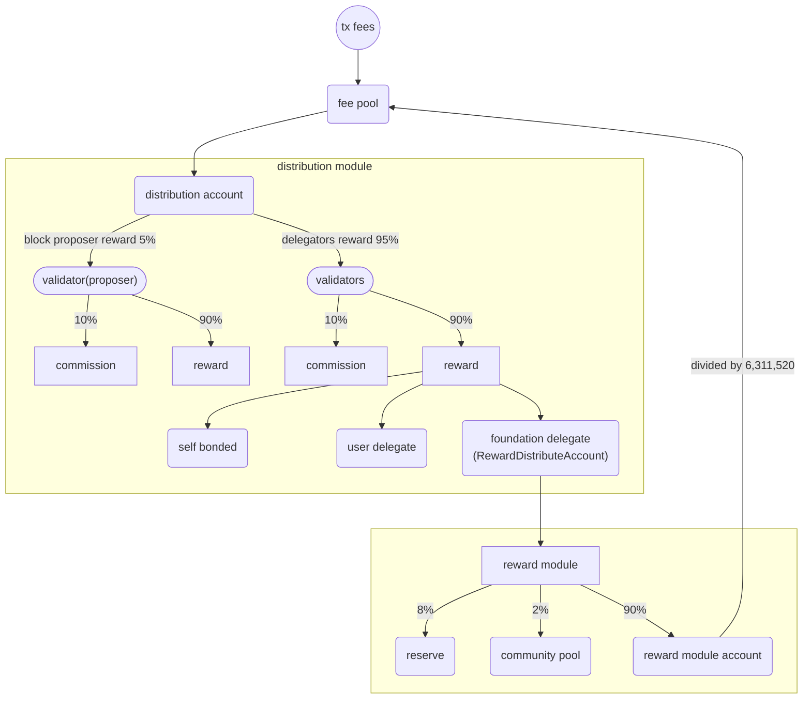

## Distribution

Before explaining the rewards module, please refer to the [Distribution module](https://docs.xpla.io/develop/develop/core-modules/distribution/) for general reward distribution. Reward distribution is done for each block, and events that occur in the current block are distributed in the Begin Event through verification in the next block. Distribution consists of two modules: Distribution and Reward.

## Concepts

The reward module supports settlement to validators.

`RewardDistributeAccount` stakes XPLA and a portion of all delegation rewards accrued in `RewardDistributeAccount` are moved to the `reward module account` and devoted to settlement funds, which help validators to settle down on the XPLA Chain.

## Transitions

### Begin-Block

Each abci begin block call, the reward module claims all delegation rewards of `RewardDistributeAccount`. It claims every block, and this claimed reward is distributed to the `reward module account`, `community pool`, and `reserve account`. The ratio among recipients follows the [parameters](). The amount collected in the `reward module account` is divided by the number of expected blocks per year (6,311,520), and 1 block reward is sent to the `fee pool`. Finally, the rewards in the `fee pool` is distributed to all the validators in the active set and their delegators.



### Reward Type

1. block `proposer` reward: The block proposer reward consists of base proposer reward and bonus proposer reward, see the [Distribution Scheme](https://docs.xpla.io/develop/develop/core-modules/distribution/#the-distribution-scheme)
    - `base proposer reward`: The fixed base reward bonus for the validator proposing a block, as a proportion of transaction fees.
    - `bonus proposer reward`: The maximum additional reward bonus for the validator proposing a block, as a proportion of transaction fees.
2. validator's `commission`: The percentage of staking rewards a validator keeps before distributing the rest of the rewards to delegators. Commission is a validator’s income. Validators set their own commission rate, see the [Validator FAQ](https://docs.xpla.io/full-node/full-node/manage-a-validator/validator-faq/#what-is-a-validators-commission)
3. `self-bonded` reward: A validator operator’s “self-bond” refers to the amount of XPLA delegated to itself, see the [Validator FAQ](https://docs.xpla.io/full-node/full-node/manage-a-validator/validator-faq/#are-validators-required-to-self-bond-xpla)
4. `delegators` reward: Revenue generated from fees given to validators and disbursed to delegators. see the [Validator FAQ](https://docs.xpla.io/full-node/full-node/manage-a-validator/validator-faq/#rewards)

### Reward Module Distribution
1. `reserve account`: In case of emergencies within the ecosystem (such as hacking), emergency capital.
2. `community pool`: Sustainable securing of quantities available for autonomous utilization within the community.
3. `reward module account`: This is to allocate a higher quantity of fees to staked validators and users.

## Parameters

The subspace for the reward module is `reward`.

```go
// Params defines the set of params for the reward module.
type Params struct {
	FeePoolRate             github_com_cosmos_cosmos_sdk_types.Dec `protobuf:"bytes,1,opt,name=fee_pool_rate,json=feePoolRate,proto3,customtype=github.com/cosmos/cosmos-sdk/types.Dec" json:"fee_pool_rate" yaml:"fee_pool_rate"`
	CommunityPoolRate       github_com_cosmos_cosmos_sdk_types.Dec `protobuf:"bytes,2,opt,name=community_pool_rate,json=communityPoolRate,proto3,customtype=github.com/cosmos/cosmos-sdk/types.Dec" json:"community_pool_rate" yaml:"community_pool_rate"`
	ReserveRate             github_com_cosmos_cosmos_sdk_types.Dec `protobuf:"bytes,3,opt,name=reserve_rate,json=reserveRate,proto3,customtype=github.com/cosmos/cosmos-sdk/types.Dec" json:"reserve_rate" yaml:"reserve_rate"`
	ReserveAccount          string                                 `protobuf:"bytes,4,opt,name=reserve_account,json=reserveAccount,proto3" json:"reserve_account,omitempty"`
	RewardDistributeAccount string                                 `protobuf:"bytes,5,opt,name=reward_distribute_account,json=rewardDistributeAccount,proto3" json:"reward_distribute_account,omitempty"`
}
```
